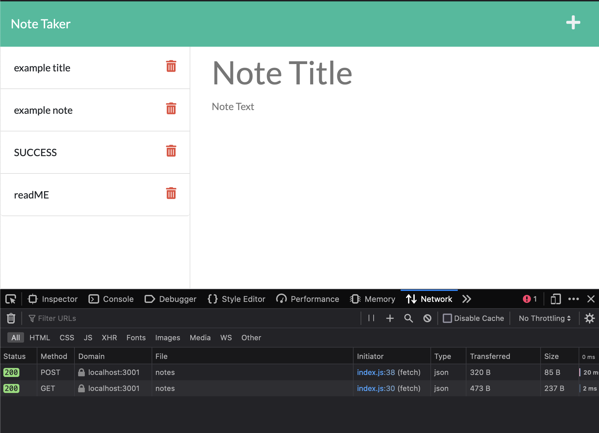
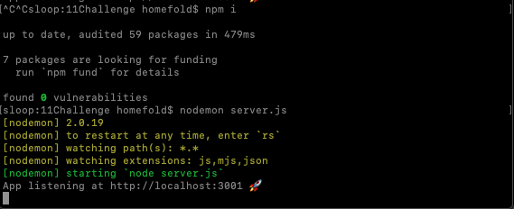
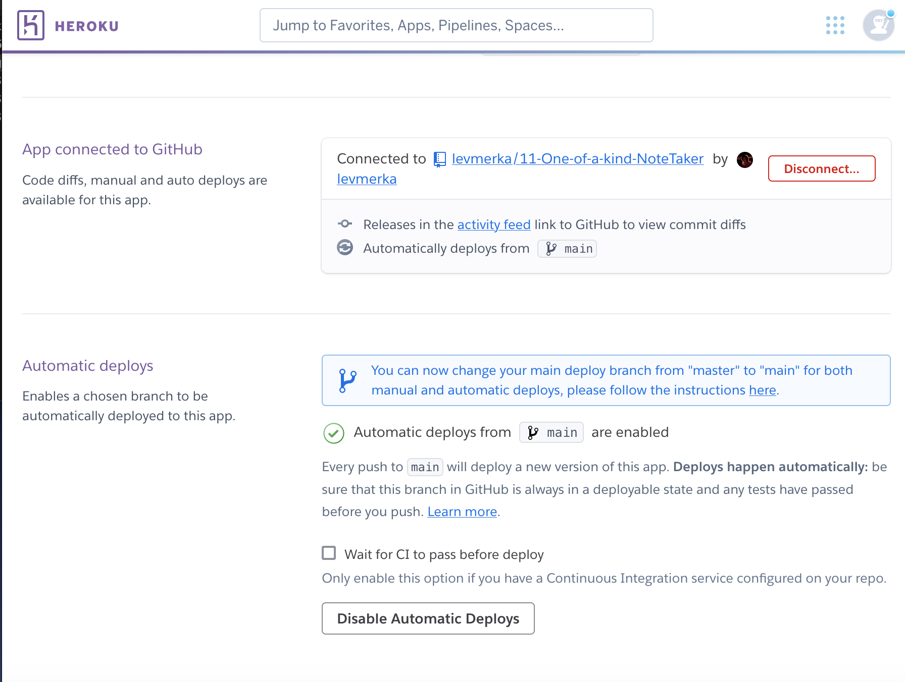
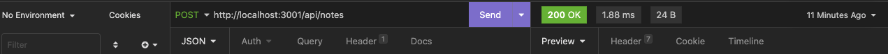

### 

## GitHub: https://github.com/levmerka/11-One-of-a-kind-NoteTaker.git

# One of a Kind* Note Taker

## Table of Contents:

- [Description](#description)
- [Installation](#installation)
- [Usage](#usage)
- [Contributors](#contributing)
- [Tests](#tests)
- [Questions](#questions)

## Description

This application uses node express and JavaScipt to connect an existing front-end to a server which I have implemented. The back-end is all being executed via a server.js communicating with front-end and back-end throught modularized routes. It has been uploaded to heroku for assignment purposes.

  

## Installation

You will need npm express to view and host the server locally 
I also used npm uuid & nodemon to make hot changes while building

  

## Usage

use free on heroku! : https://one-of-a-kind-note-taker.herokuapp.com/notes

  

## Contributing

 AskBCS helped

## Tests

nodemon running globally
I used Insomnia to test GET and POST routes

  

## Questions?

If there are any questions please reach out to: lev@merka.us